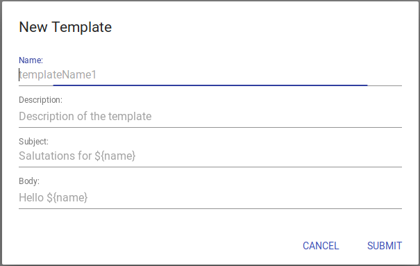
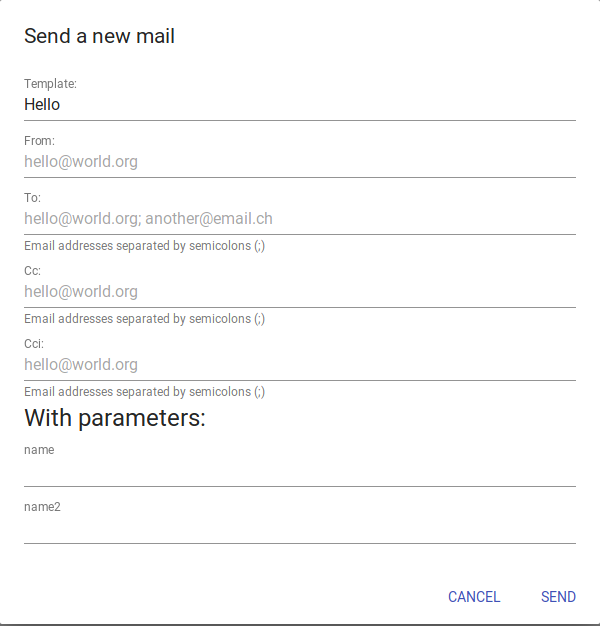
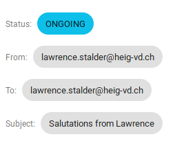

# Introduction

This app allows the administration of the Lozzikit - Mail service. 
It was develloped during the TWEB course at the University of Applied Sciences of Yverdon.

## Installation

```
$ npm install
$ npm start
```

Installs the dependencies of the app and runs it in development mode.<br>
Open [http://localhost:3000](http://localhost:3000) to view it in a browser.

The page will reload if you make edits.<br>
Any lint errors will appear in the console.

```
$ npm run build`
```

Builds the app for production in the `build` folder.<br>
It correctly bundles React in production mode and optimizes the build for best possible performance.

The build is minified and the filenames include the hashes.<br>
Your app is ready to be deployed!

## Usage

In order for the app to function properly, the Lozzikit - [Mail microservice](https://github.com/LozziKit/microservice-mail) **must** be running on the machine (for example with the docker-compose configuration file) and the app must be configured with the appropriate URL to reach the microservice.

If the micro-service can't be reached at the same address and port as the host of the app, the host must enable Cross-Origin Resource Sharing.

### Create a Template

Select the template tab and press the **+** icon to create a template.<br>



You can always edit or delete the template later.

### Create a Mail

Select the mail tab and press the **+** icon to create a mail, specify the template name if needed.<br>



Choose the parameter to complete the mail.

While the mail is being sent you will be prompted with this screencap. You can cancel the job from here.



# Thanks

This project was bootstrapped with [Create React App](https://github.com/facebookincubator/create-react-app).

This interface uses the following projects:

* [Material-UI](https://material-ui-next.com/) for the user interface.
* [React Router DOM](https://reacttraining.com/react-router/) for the routing of the single-page.
* [Superagent](https://github.com/visionmedia/superagent) for the api request.
